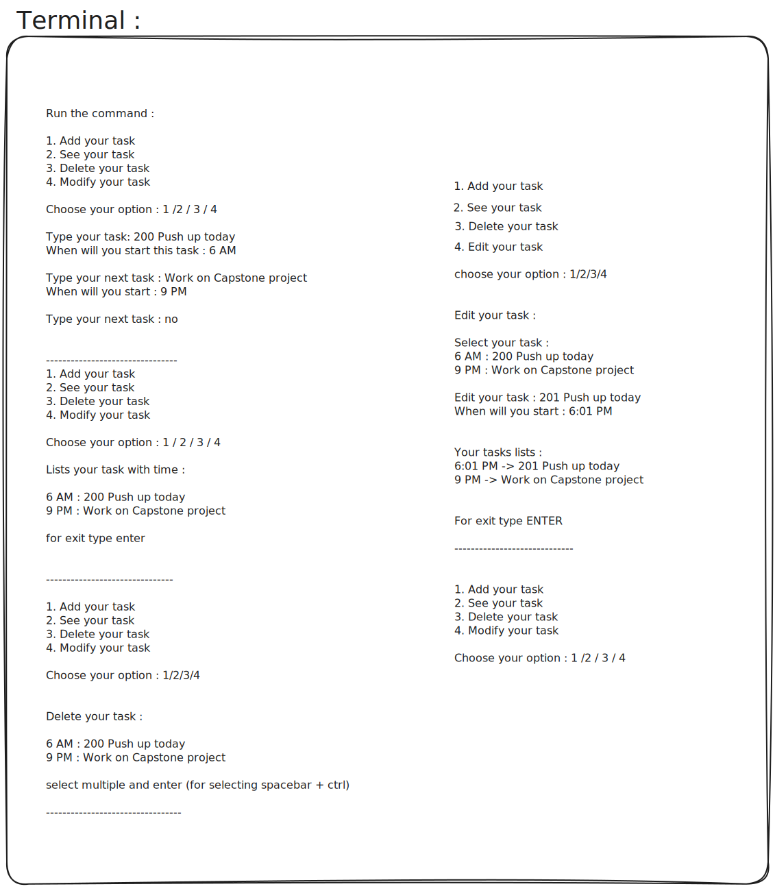
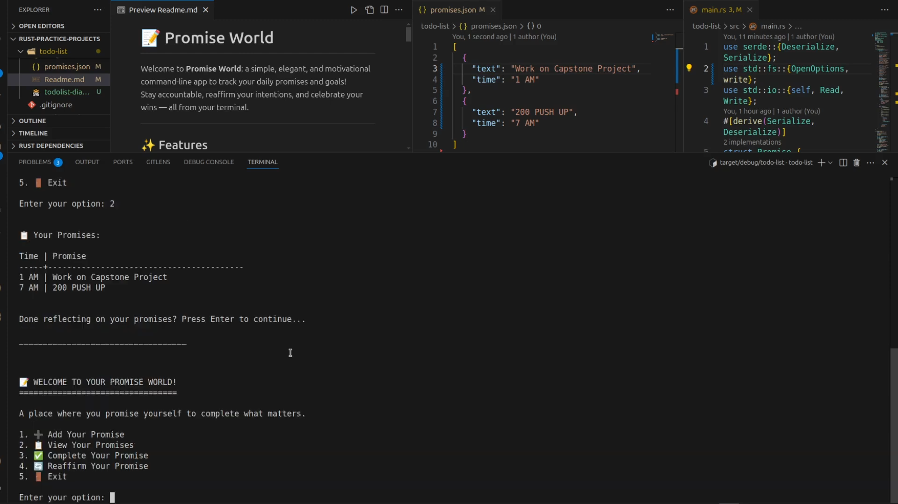

# 📝 Promise World 

Welcome to **Promise World**: a simple, elegant, and motivational command-line app to track your daily promises and goals!  
Stay accountable, reaffirm your intentions, and celebrate your wins — all from your terminal.

---

## 🗺️ Project Diagram



---

## 🎬 Demo Video

[](https://youtu.be/RrfKRRF68mY)

---

## ✨ Features

- **Add Promises:** Capture what matters to you, with a description and a time.
- **View Promises:** See all your commitments in a clean, tabular format.
- **Complete Promises:** Mark promises as done and keep your list up-to-date.
- **Reaffirm Promises:** Edit or update your promises to stay aligned with your goals.
- **Persistent Storage:** All promises are saved in a human-readable `promises.json` file.

---

## 🚀 Getting Started

### 1. Clone the Repository

```bash
git clone https://github.com/yourusername/promise-world.git
cd promise-world/todo-list
```

### 2. Build and Run

Make sure you have [Rust](https://www.rust-lang.org/tools/install) installed.

```bash
cargo run
```

---

## 🖥️ Usage

When you run the app, you'll see:

```
📝 WELCOME TO YOUR PROMISE WORLD!
=================================

A place where you promise yourself to complete what matters.

1. ➕ Add Your Promise
2. 📋 View Your Promises
3. ✅ Complete Your Promise
4. 🔄 Reaffirm Your Promise
5. 🚪 Exit
```

Just enter the number for your desired action and follow the prompts!

---

## 📦 Data Format

Your promises are stored in a simple JSON file:

```json
[
  {
    "text": "Read 20 pages of a book",
    "time": "8:00 PM"
  },{
    "text": "200 Pushup",
    "time": "7:30 PM"
  }
]
```

---

## 💡 Why Promise World?

- **Motivational:** Keeps you focused on what matters.
- **Simple:** No clutter, no distractions — just your promises.
- **Customizable:** Easily edit, complete, or reaffirm your promises.

---

## 🤝 Contributing

Pull requests and suggestions are welcome!  
Feel free to open an issue or submit a PR to improve features, design, or documentation.

---

## 📄 License

This project is licensed under the [MIT License](LICENSE).

---

## 🙏 Acknowledgments

Special thanks to everyone who inspires us to keep our promises and strive for personal growth.

- Crafted with ❤️ using Rust.
- Inspired by a commitment to self-improvement and accountability.

---

## 📬 Contact

For questions, suggestions, or collaboration opportunities, feel free to reach out:

- Twitter/X: [@nishantweb3](https://x.com/nishantweb3)

---